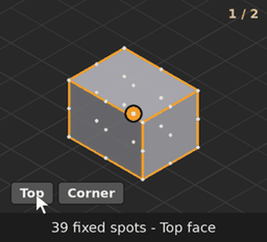
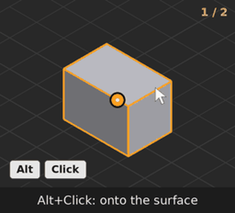
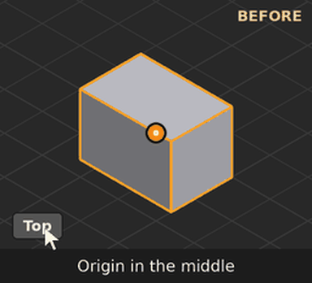

# Orivot Free

**Exact origin placement for Blender.** Snap an object's origin to 39 exact points: its extreme sides, corners, edge midpoints and face centres, or to its geometry, bounding-box or mass centre. One click, no Edit Mode, no 3D Cursor juggling. The geometry stays where it is.

Built for architecture, interiors and exhibition work, where an origin at the floor, a corner or a wall face is the difference between "snap into place" and "nudge for a minute".

<p align="center">
  
  
</p>

## Features

- **Snap Points:** the origin goes to any of 39 points on the object.
  - The six extreme sides: Top, Bottom, Left, Right, Front, Back.
  - The 8 corners.
  - The 12 edge midpoints.
  - The face centres.
  - The Geometry, Bounding-Box and Mass centres.
- **Snap Source:**
  - **Mesh** uses the real evaluated geometry, modifiers included. On a sphere, "Top" is the pole; on a roof, it is the ridge.
  - **Bounding Box** uses the object's box.
  - **3D Cursor** moves the origin to the cursor.
- **Local or Global orientation, and a Front axis.** "Front" and "Left" mean the object's own front, not just −Y.
- **Quick Snap:** the origin goes to the 3D Cursor or to World Zero.
- **Alt+Q pie menu** with configurable slots, plus **Object ▸ Set Origin to...** and right-click menu entries.
- **In-panel help:** a **?** on each panel plays a short animation of what it does.
- **Works on many objects at once:** every selected mesh gets its own origin snapped.
- **Greyed-out, not broken:** buttons that can't act on the selection (a curve, an empty, text) are greyed out, and their tooltip says why.

Everything lives in the **Orivot** tab of the 3D Viewport sidebar (N).

<p align="center"></p>

## Install

Requires **Blender 4.5 LTS or newer**. Tested on 4.5 LTS, 5.0 and 5.2 LTS.

1. Download `orivot_free-<version>.zip` from [Releases](../../releases). Don't unzip it.
2. In Blender, open **Edit ▸ Preferences ▸ Get Extensions**, then choose **⌄ ▸ Install from Disk...** and pick the zip.
3. Open the sidebar (N) in the 3D Viewport and go to the **Orivot** tab.

To install from source instead, zip the `orivot_free/` folder, or build it with Blender's extension tool:

```
blender --command extension build --source-dir orivot_free --output-dir .
```

## Editions

Orivot comes in three editions. Free is open source and stays free. Basic and Pro are paid and add the tools for production work.

| | Free | Basic | Pro |
|---|:---:|:---:|:---:|
| 39 snap points, object centres, 3D Cursor, World Zero | ✓ | ✓ | ✓ |
| Alt+Q pie menu, Object menu, in-panel help | ✓ | ✓ | ✓ |
| Surface / Vertex snap (Alt+click on the mesh) | | ✓ | ✓ |
| Clickable bounding-box handles | | ✓ | ✓ |
| Live origin preview | | ✓ | ✓ |
| Multi-Object (Individual / Combined; from the selection, a list or a collection) | | ✓ | ✓ |
| Offset & Freeze, normal offset | | ✓ | ✓ |
| Copy / Paste origin, Mirror Plane, Snap to Grid, Batch Normalize | | ✓ | ✓ |
| Edit Mode selection snaps, snap history | | ✓ | ✓ |
| Along Curve (start / middle / end / %, follow along, spline selection) | | | ✓ |
| Origin Axes, Object Snaps, Place by Hover, Surface Align | | | ✓ |
| Line Snap, Axis Transform, Collision, Chain, Scene Snap | | | ✓ |
| Pivot Library, Saved Configurations, CSV import / export | | | ✓ |
| Fabrication: cut files, nesting, assembly, datums | | | ✓ |
| | **Free** | [**Get Basic**](https://discord.com/users/damagedarchitect) | [**Get Pro**](https://discord.com/users/damagedarchitect) |

Install one edition at a time. They share tool names, so Blender refuses a second one with a message. Disable Free before you install Basic or Pro.

Orivot Basic and Orivot Pro are available from the author: **[contact on Discord](https://discord.com/users/damagedarchitect)**.

## Coming from Radix Free or PivotForge Free?

Orivot Free replaces both. Remove the old add-on before installing (Orivot uses the id `orivot_free`, so Blender treats it as a new add-on). The panel is now the **Orivot** tab. Clickable bounding-box handles moved to Orivot Basic.

## Support

- Bugs and requests: [Issues](../../issues). Include your Blender version and the steps to reproduce.
- Contact: [Discord](https://discord.com/users/damagedarchitect) · cratercreativeconsultancy@gmail.com
- Author: **DaMagedArchitect**, Crater Creative Consultancy L.L.C., Abu Dhabi.

## Contributing

Bug reports and feature requests are welcome via [Issues](../../issues). Pull requests are reviewed, but large feature additions go to the paid editions; small fixes, documentation and compatibility patches are the most likely to be merged.

## License

[GPL-3.0-or-later](LICENSE), like Blender itself. © 2026 Crater Creative Consultancy L.L.C.
